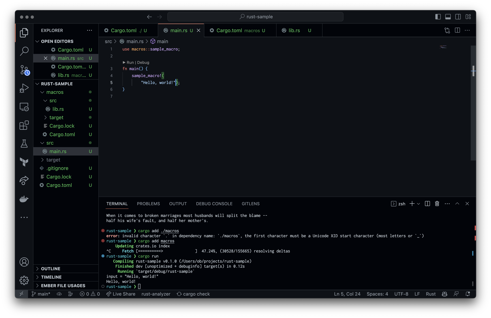

# Repro for a VS Code or rust-analyzer bug

This is a minimal repro for a bug in VS Code or rust-analyzer.
I'm not sure whether the bug is in `cargo`, `rust-analyzer`, or the VS Code extension.

What happens is that when you have a procedural macro that prints to stdout, and then
you try to modify the place where the macro is invoked, the editor will hang.

Here's a screenshot of the hang:



In order to reproduce the bug, you need to do the following:

* Open the project in VS Code
* Open `macros/src/lib.rs`
* Uncomment the `println!` line
* Open `src/main.rs`
* Start editing the call to the `sample_macro` macro, you should see the editor hang.

The "Rust Analyzer Language Server" log shows the following:

```
Error: Custom { kind: InvalidData, error: Error("unknown variant `ApiVersionCheck`, expected `ListMacros` or `ExpandMacro`", line: 1, column: 18) }
```

The Rust Analyzer extension version is v0.4.1397.

